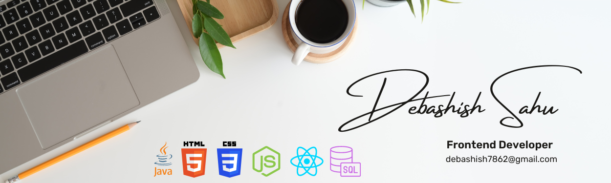

### Hi there 👋

## I am Debashish ,I completed my post-graduate studies in Master of Computer Applications in 2022. Currently, I am actively enhancing my skill set by exploring emerging technologies. At present, I am focusing on JavaScript and working towards improving my expertise in front-end development!

- 🔭 I’m currently working on ... HTML CSS JS REACT
- 🌱 I’m currently learning ... Fullstack Developement 😊
- 💬 Ask me about anything in Frontend Dev I bet I will answer 😂
- ⚡ Fun fact: I love photography,videography, gyming, and coding
- 🎸 Would love: To know how to play guitar

- 📝[Resume](#)

### Connect with me:

  

### Languages and Tools:

 
 
 
 

 
 

  

## Stats summary📈

 

## 📝 Latest Projects

Here's a list of my latest projects:

- [Pizza Ordering Website](https://earnest-pavlova-03d171.netlify.app/)
- [Reciepe Finder](https://debashish7862.github.io/Recipe-Search/)
- [Inshorts Clone](https://debashish7862.github.io/News-Application/)
- [AIRBNB Clone](https://debashish7862.github.io/MCT-oct/)

## <h2 align="center">Other links🔗</h2>

 

<a href="https://www.freecodecamp.org/debashish7862" target="_blank"> 
<a href="https://leetcode.com/debashish7862/" target="_blank"> 

 
